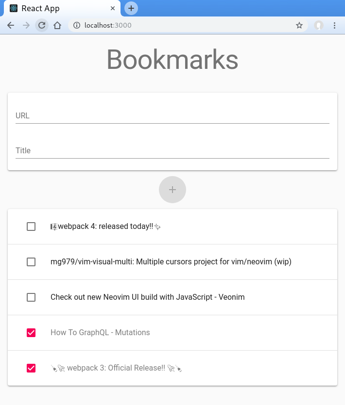
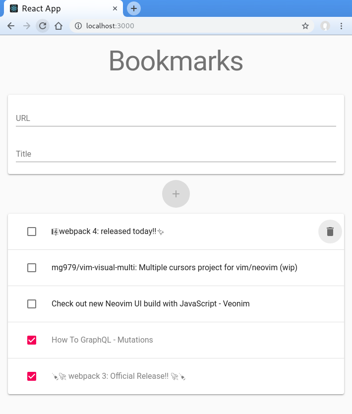
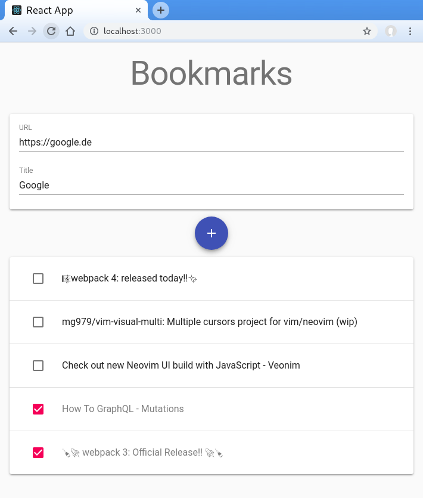

# Bookmarks App

[TodoMVC](http://todomvc.com/) like app to try out technologies. In this version I tried [Apollo Client](https://www.apollographql.com/client/) in the frontend and a [json-graphql-server](https://github.com/marmelab/json-graphql-server) as backend mock.

## Usage

-   add a bookmark and insert a title as description
-   mark bookmark as un-/read with the checkbox on left hand side
-   delete a bookmark by hovering over the item and then clicking on the trash icon on the right hand side
-   go to the url of the bookmark by clicking on the item itself

## Nothworthy code features

-   vite as modern version of Create React App
-   optimistic UI for "mark as read/unread"
    -   updates UI before server responded
    -   this approach shows easily that it should be used with care: the list doesn't reorder itself! This is because the sort logic is only in the backend/server, not in frontend.

## Run it on your own

-   clone repo
-   `npm ci`
-   open two terminals and run
    -   `npm run dev` starts frontend server
    -   `npm run dev:server` starts fake backend

## Screenshots

### Normal view

### Hover over item

### Add form

